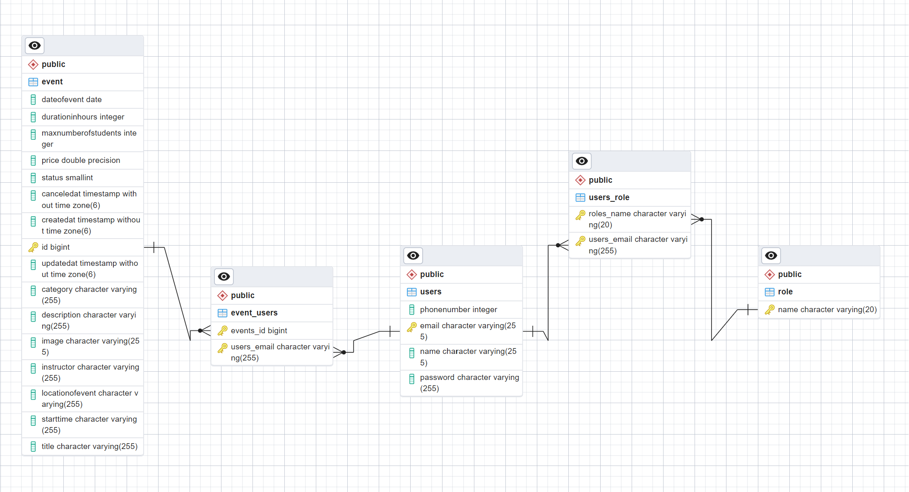

# SP-2

## ERD

 
 ## Endpoints

| HTTP method | REST Resource                          |                                                                                                                                                                                                                                                                                                                                                                                                                                                                                                                                                                                       | Comment                                                         |
| ----------- | -------------------------------------- | ------------------------------------------------------------------------------------------------------------------------------------------------------------------------------------------------------------------------------------------------------------------------------------------------------------------------------------------------------------------------------------------------------------------------------------------------------------------------------------------------------------------------------------------------------------------------------------- | --------------------------------------------------------------- |
| POST        | `/api/auth/login`                      | `request:`  <pre lang="json">{&#13; "email":"email",&#13; "password":"password",&#13; "name":"name",&#13;"phonenumber":0,&#13; }</pre>                                                                                                                                                                                                                                                                                                                                                                                                                                             | Login                                                           |
| POST        | `/api/auth/logout`                     | `request:` satus code                                                                                                                                                                                                                                                                                                                                                                                                                                                                                                                                                                 | Logout                                                          |
| POST        | `/api/auth/register`                   | `request:`  <pre lang="json">{&#13;"email":"email",&#13; "password":"password",&#13; "name":"name",&#13;"phonenumber":0,&#13;[],&#13; }</pre>                                                                                                                                                                                                                                                                                                                                                                                                                                      | Register                                                        |
| POST        | `/api/auth/addRoleToUser`              | `request:`  <pre lang="json">{&#13;"email":"email",&#13;"role":"role",&#13; }</pre>                                                                                                                                                                                                                                                                                                                                                                                                                                                                                                | Add a role to a user                                            |
| PUT         | `/api/event/registerUser`              | `request:`  <pre lang="json">{&#13;"email":"email",&#13;"id":0,&#13; }</pre>                                                                                                                                                                                                                                                                                                                                                                                                                                                                                                       | Adds a user to an event                                         |
| PUT         | `/api/event/cancelRegistration`        | `response:` none                                                                                                                                                                                                                                                                                                                                                                                                                                                                                                                                                                      | Cancels a registration                                          |
| PUT         | `/api/event/createEvent`               | `response:`  <pre lang="json">{&#13; "title": String,&#13; "startTime": String,&#13; "description": String,&#13; "dateOfEvent": String,&#13; "durationInHours: number,&#13; "maxNumberOfStudents: number,&#13; "locationOfEvent": String,&#13; "instructor": String,&#13; "price: number,&#13; "category": String,&#13; "image": String,&#13; "status": enum,&#13;}</pre>                                                                                                                                                                                                          | Create a new event                                              |
| GET         | `/api/event/upcoming`                  | `response:`  <pre lang="json">[{&#13; "id": 0,&#13; "title": "String",&#13; "startTime": "String",&#13; "description": "String",&#13; "dateOfEvent": "String",&#13; "durationInHours": 0,&#13; "max0OfStudents": 0,&#13; "locationOfEvent": "String",&#13; "instructor": "String",&#13; "price": 0,&#13; "category": "String",&#13; "image": "String",&#13; "status": "enum",&#13; "createdAt": "String",&#13; "updatedAt": "String",&#13; "canceledAt": "String",&#13; "users": [{&#13;  "email": "String",&#13;  "name": "String",&#13;  "phone0": 0,&#13;  }]&#13; }]</pre>     | Retrive all upcoming events                                     |
| GET         | `/api/users`                           | `response:`  <pre lang="json">{&#13; "email": "String",&#13; "password": "String",&#13; "newPassword": "String",&#13; "name": "String",&#13; "phone0": 0,&#13; "roles":[{&#13;  "roleTitle": "String"&#13;  }]&#13;}</pre>                                                                                                                                                                                                                                                                                                                                                         | Retrive all users                                               |
| PUT         | `/api/users/update`                    | `request:`  <pre lang="json">{&#13;  "email": "String",&#13;  "newPassword": "String"&#13;}</pre>                                                                                                                                                                                                                                                                                                                                                                                                                                                                                  | update a user                                                   |
| GET         | `/api/users/delete/{id}`               | `response:` status code                                                                                                                                                                                                                                                                                                                                                                                                                                                                                                                                                               | Delete a specific user                                          |
| PUT         | `/api/event/cancelEvent/{id}`          | `response:` none                                                                                                                                                                                                                                                                                                                                                                                                                                                                                                                                        | Cancels a spesific event                                        |
| GET         | `/api/events`                          | `response:`  <pre lang="json">[{&#13; "id": 0,&#13; "title": "String",&#13; "startTime": "String",&#13; "description": "String",&#13; "dateOfEvent": "String",&#13; "durationInHours": 0,&#13; "maxNumberOfStudents: 0,&#13; "locationOfEvent": String,&#13; "instructor": String,&#13; "price": 0,&#13; "category": "String",&#13; "image": "String",&#13; "status": "enum",&#13; "createdAt": "String",&#13; "updatedAt": "String",&#13; "canceledAt": "String",&#13; "users": [{&#13;  "email": "String",&#13;  "name": "String",&#13;  "phoneNumber": 0,&#13;  }]&#13; }]</pre> | Retrieve all events                                             |
| PUT         | `/api/events/{id}`                     | `request:`  <pre lang="json">{&#13; "title": String,&#13; "startTime": String,&#13; "description": String,&#13; "dateOfEvent": String,&#13; "durationInHours": 0,&#13; "maxNumberOfStudents": number,&#13; "locationOfEvent": String,&#13; "instructor": String,&#13; "price: number,&#13; "category": String,&#13; "image": "String",&#13; "status": "enum",&#13; "createdAt": "String",&#13; "updatedAt": "String",&#13; "canceledAt": "String",&#13; "users": [{&#13;  "email": "String",&#13;  "name": "String",&#13;  "phoneNumber": 0,&#13;  }]&#13; }</pre>                       | Updates an event                                                |
| GET         | `/api/events/{id}`                     | `response:`  <pre lang="json">{&#13; "title": String,&#13; "startTime": String,&#13; "description": String,&#13; "dateOfEvent": String,&#13; "durationInHours: number,&#13; "maxNumberOfStudents: number,&#13; "locationOfEvent": String,&#13; "instructor": String,&#13; "price: number,&#13; "category": String,&#13; "image": "String",&#13; "status": "enum",&#13; "createdAt": "String",&#13; "updatedAt": "String",&#13; "canceledAt": "String",&#13; "users": [{&#13;  "email": "String",&#13;  "name": "String",&#13;  "phoneNumber": 0,&#13;  }]&#13; }</pre>                      | Retrieves a spesific event                                      |
| GET         | `/api/events/category/{category}`      | `response:`  <pre lang="json">{&#13;"category": "String",&#13;}</pre>                                                                                                                                                                                                                                                                                                                                                                                                                                                                                                                | Retrieves the subset of all events that have a spcific category |
| GET         | `/api/events/status/{status}`          | `response:`  <pre lang="json">{&#13;"status": "enum",&#13;} </pre>                                                                                                                                                                                                                                                                                                                                                                                                                                                                                                                   | Retrieves the subset of all events that have a spcific status   |
| GET         | `/api/registrations/{id}`              | `response:`  <pre lang="json">{&#13; "email":"email",&#13; "password":"password",&#13; "name":"name",&#13;"phonenumber":0,&#13; }</pre>                                                                                                                                                                                                                                                                                                                                                                                                                                            | Retrieves all registrations to a spesific event                 |
| GET         | `/api/registration/{userid}/{eventid}` | `response:` <pre lang="json">{&#13;"msg":"Registration found/Registration not found"&#13;}</pre>                                                                                                                                                                                                                                                                                                                                                                                                                                                                                   | Tells if the user is registed to a spesific event               |
